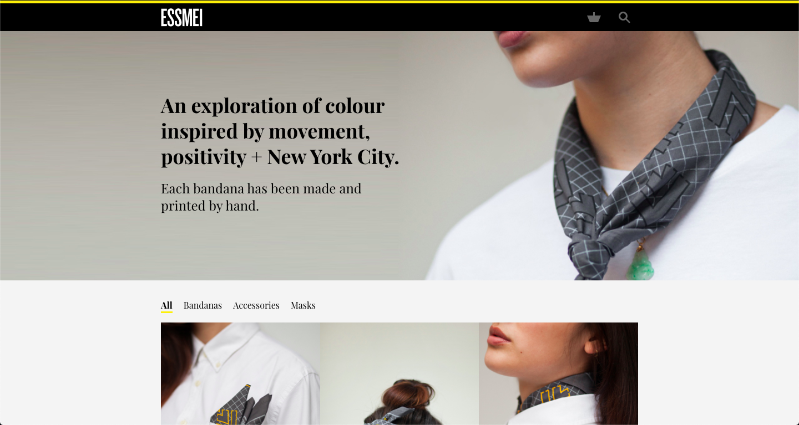
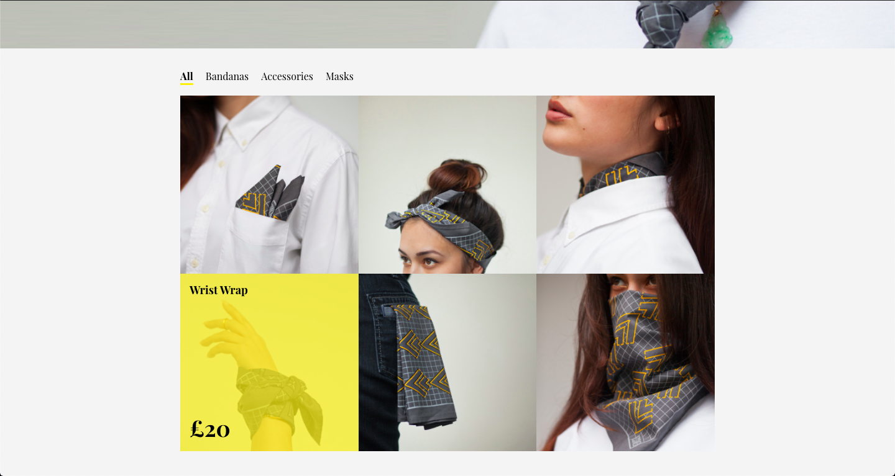
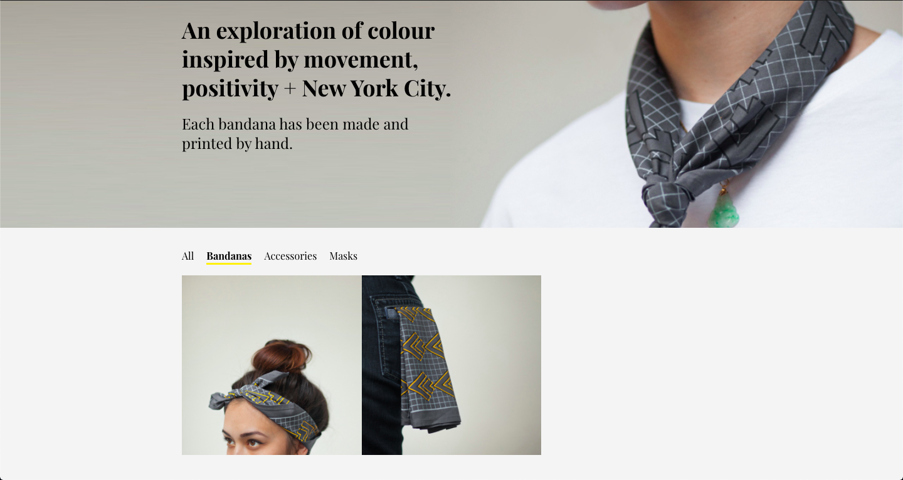

# Essmei
Site for accessories brand Essemi, using jQuery filters.

## Table of contents
* [General info](#general-info)
* [Screenshots](#screenshots)
* [Technologies](#technologies)
* [Demo](#demo)
* [Features](#features)
* [Status](#status)
* [Contact](#contact)

## General info
This was the fifth project on the [Superhi Foundation](https://superhi.com/courses/html-css-javascript-foundation) course. It introduced javascript through jQuery. Bulding on the techiques from last week, this utilises hover overlays to reveal additional information about the products. And then uses javascript to filter the number of products by product type. 

## Screenshots

## Technologies
* HTML5
* CSS3
* jQuery v3.5.1

## Demo
[Live Demo](guybroadhurst.github.io/essmei/)

## Features
List of features:
* Filters on the products using jQuery.
* Nice hover overlay with product name and price. 
* Flexible layout using CSS flexbox.

## Status
Project is: _finished_ and complete for the course.
 
## Contact
Created by [@guybroadhurst](https://www.guybroadhurst.co.uk/) - feel free to contact me!